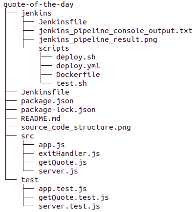
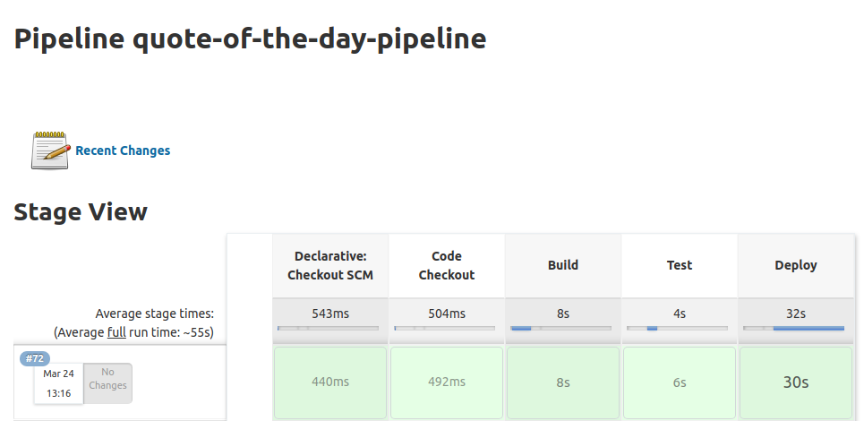

# quote-of-the-day
A simple server that returns a random quote upon each request.

NOTE:
Due to time constraint, instead of finding a server that can produce random quotes, a server that produces random joke of the day is used.
The server is located at https://sv443.net/jokeapi/v2/joke.

# Project Structure

The project source code structure is shown below:

Some of these directories and hidden files are excluded in the ".gitignore" file.

# Testing

Test cases are stored in the "test" directory; this faciliatate the use of globally installed mocha. Each test file is also named in the <module>.test.js
format to facilitate the use of Jest. A test suite is created in an individual file for the corresponding source file in the "src" directory
(except for exitHandler.js, a task to be completed). The implemented tests cover the following aspects of testing to varying degree:
* REST API testing
* Integration testing
* End-to-End testing

A number of testing frameworks and libraries are used, including mocha and chai. Jest was added initially to do coverage testing. Later on, mocha was
also supplemented with nyc to carry out coverage testing.

The coverage test results showed that there are some untested areas. Other test results also showed that there is an issue with proper exiting in the
test code. Future enhancements should include the completion of these outstanding tasks.

# Coding 

VSCode is used as the development environment for the project. The "prettier" library and the "auto format on save" feature of VSCode were used together
to maintain a consistent style in the source code.

# Continuous Integration (CI) / Continuous Deployment

The source code of the project are version controlled using GitHub. Jenkins is used to create a CI/CD pipeline consisting of the following phases:
1. Code Checkout
   Jenkins polls GitHub periodically. If there is any changes, it retrieves the project source code from the repo.
2. Build
   Jenkins initiates the build of the project. In this case, it is simply ensuring that all dependencies are ready at hand.
3. Test
	 Jenkins invokes a test script to run tests.
4. Deploy
   Jenkins invokes a deploy script to deploy the app. A number of different tools are used, namely, Ansible, Docker, DockerHub, Kubernetes, AWS.
   The deployment procedure consists of:
	 1. Stop running docker containers
   2. Remove docker containers
   3. Remove docker image
   4. Build a new docker image of the project
   5. Create a new docker tag
   6. Push the new docker tag to Docker Hub.
   7. Remove the pushed docker image
   8. Create Kubernetes service on AWS
   9. Create a new Kubernetes deployment
   10. If docker image was updated in Docker Hub, update the deployment with new pods too.

Note that step 8 to step 10 of the Deploy phase have not been completed yet.

The result of the Jenkins pipeline is shown below:

The corresponding console output is shown in the file jenkins/jenkins_pipeline_console_output.txt.

# Future Enhancements / Bug fix Tasks 

1. Consider using NODE_ENV
2. Consider creating a env var module to read environment variables, and use this in other modules
3. Implement HTTPS if sensitive information are to be transmitted.
4. Fix test code so that it does not prevent jest/mocha from exiting at end of test.
5. Deploy app to Kubernetes on AWS.
